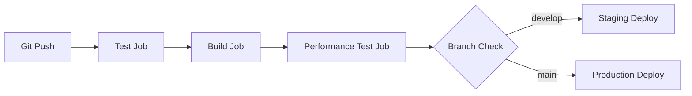

# CI/CD Pipeline Documentation

## Overview
Автоматизированный CI/CD pipeline для ERP-сервера, обеспечивающий непрерывную интеграцию, тестирование и деплой приложения.

## Pipeline Architecture

### Workflow Stages


### Job Dependencies
```
test ──► build ──► performance-test
              ├──► deploy-staging (develop branch)
              └──► deploy-production (main branch)
```

## Jobs Description

### 1. Test Job
**Purpose**: Запуск всех уровней тестирования
- **Environment**: Ubuntu latest + PostgreSQL 13
- **Steps**:
  - Unit tests
  - Integration tests
  - E2E tests
- **Requirements**: Node.js 18, npm, PostgreSQL

### 2. Build Job
**Purpose**: Компиляция TypeScript в JavaScript
- **Triggers**: После успешного прохождения тестов
- **Output**: Скомпилированные файлы в `dist/`
- **Artifacts**: Загружаются для использования в других jobs

### 3. Performance Test Job
**Purpose**: Нагрузочное тестирование собранного приложения
- **Tools**: Artillery
- **Metrics**: Response time, throughput, error rate
- **Reports**: Генерируются и сохраняются как артефакты

### 4. Deploy Jobs
**Purpose**: Автоматический деплой в соответствующие среды
- **Staging**: Для develop ветки
- **Production**: Для main ветки (после performance тестов)

## Configuration Files

### GitHub Actions Workflow
Файл: `.github/workflows/ci-cd.yml`

**Key Features**:
- Matrix testing для разных Node.js версий
- Service containers для базы данных
- Artifact sharing между jobs
- Conditional deployment logic

### Test Environment Variables
Файл: `.env.test`

**Configuration**:
- Тестовая база данных
- Время ожидания тестов
- Настройки логирования
- Mock сервисы для внешних зависимостей

## Test Automation

### Test Execution Flow
1. **Setup**: Инициализация тестовой базы данных
2. **Unit Tests**: Быстрые тесты без внешних зависимостей
3. **Integration Tests**: Тесты с реальной базой данных
4. **E2E Tests**: Полные сценарии использования API

### Performance Testing Integration
- Автоматический запуск после сборки
- Сравнение результатов с предыдущими запусками
- Fail pipeline при ухудшении производительности >10%

## Deployment Strategy

### Branch-Based Deployment
- **develop**: Автоматический деплой в staging среду
- **main**: Автоматический деплой в production после всех проверок

### Safety Measures
- Required approvals для production деплоя
- Rollback procedures при ошибках
- Health checks после деплоя
- Monitoring alerts

## Monitoring and Alerts

### Pipeline Monitoring
- **GitHub Actions Dashboard**: Статус выполнения jobs
- **Test Coverage Reports**: Автоматическая генерация
- **Performance Metrics**: Сравнение с baseline

### Alerting System
- **Failed Builds**: Уведомления в Slack/Teams
- **Performance Degradation**: Предупреждения при снижении производительности
- **Deployment Issues**: Оповещения о проблемах с деплоем

## Best Practices

### Code Quality Gates
- Минимальный coverage 80%
- Все тесты должны проходить
- Performance regression < 10%

### Security Checks
- Dependency vulnerability scanning
- Secret scanning в коде
- Container security scanning

### Optimization Tips
- Кэширование зависимостей
- Параллельное выполнение независимых тестов
- Incremental builds для ускорения

## Troubleshooting

### Common Issues
1. **Database Connection Timeouts**
   - Увеличить health check intervals
   - Проверить service container configuration

2. **Test Flakiness**
   - Использовать retry механизм
   - Изолировать тестовые данные
   - Добавить больше времени ожидания

3. **Performance Test Failures**
   - Проверить ресурсы runner'а
   - Адаптировать тестовые сценарии
   - Обновить performance baselines

### Debugging Steps
1. Проверить логи job'а
2. Воспроизвести локально
3. Проверить конфигурацию среды
4. Обратиться к monitoring данным

## Future Improvements

### Planned Enhancements
- **Automated Security Scanning**: OWASP ZAP integration
- **Advanced Performance Analytics**: Grafana dashboards
- **Multi-Environment Testing**: Dev, QA, Staging, Prod
- **Infrastructure as Code**: Terraform для сред
- **Chaos Engineering**: Resilience testing

### Scalability Considerations
- Horizontal scaling для тестовых runners
- Distributed test execution
- Cloud-based infrastructure
- Auto-scaling для performance tests