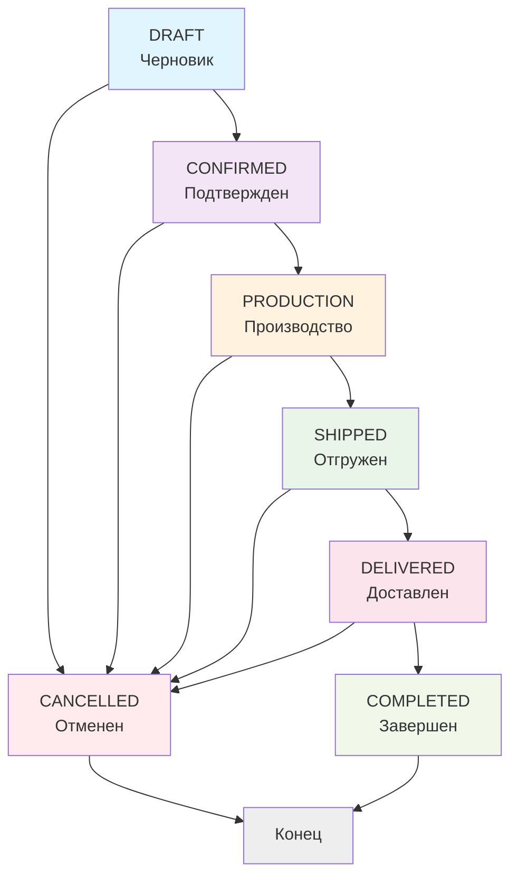
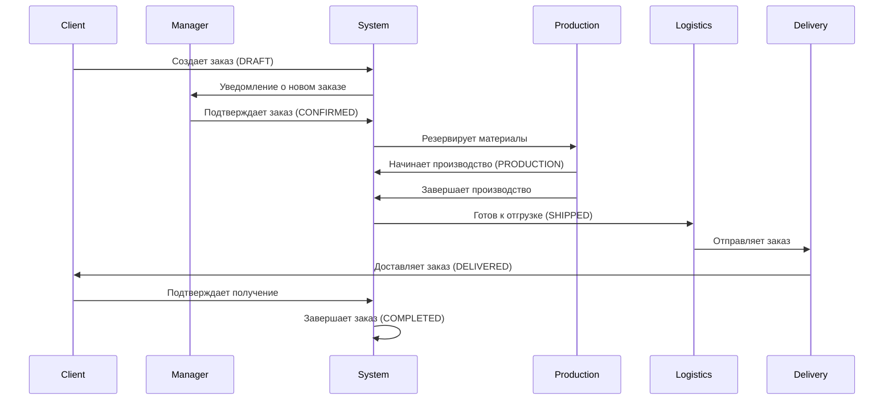
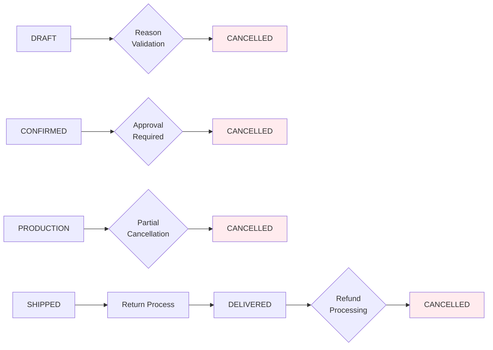

# Order Status Transitions Documentation

## Detailed State Machine

### Complete Status Flow Diagram


## Status Definitions and Business Rules

### DRAFT (Черновик) - Initial State
**Characteristics:**
- Заказ только создан и находится в процессе формирования
- Может содержать неполную информацию
- Не зарезервированы материалы
- Не начислены авансы

**Allowed Operations:**
- ✅ Добавление/удаление секций
- ✅ Добавление/удаление позиций
- ✅ Редактирование информации о клиенте
- ✅ Расчет стоимости
- ✅ Подтверждение заказа
- ✅ Отмена заказа

**Restrictions:**
- ❌ Нельзя отправить в производство
- ❌ Нельзя отгрузить
- ❌ Нельзя доставить

### CONFIRMED (Подтвержден) - Approved State
**Characteristics:**
- Заказ подтвержден менеджером
- Зарезервированы необходимые материалы
- Созданы производственные задания
- Заказ зафиксирован и не может быть изменен

**Allowed Operations:**
- ✅ Начало производства
- ✅ Отмена заказа (с ограничениями)
- ✅ Просмотр деталей

**Restrictions:**
- ❌ Нельзя изменять состав заказа
- ❌ Нельзя возвращаться в черновик
- ❌ Нельзя сразу отгружать

### PRODUCTION (Производство) - Manufacturing State
**Characteristics:**
- Заказ находится в производстве
- Отслеживается прогресс выполнения
- Контролируются сроки изготовления
- Материалы зарезервированы

**Allowed Operations:**
- ✅ Обновление прогресса производства
- ✅ Частичная отгрузка готовых позиций
- ✅ Отмена заказа (только частичная)
- ✅ Перенос сроков (с согласования)

**Restrictions:**
- ❌ Нельзя изменять состав заказа
- ❌ Нельзя полностью отменить без потерь

### SHIPPED (Отгружен) - Shipped State
**Characteristics:**
- Все позиции отгружены со склада
- Созданы транспортные документы
- Начат процесс доставки
- Обновлен статус оплаты

**Allowed Operations:**
- ✅ Отслеживание доставки
- ✅ Подтверждение получения
- ✅ Возврат части товара

**Restrictions:**
- ❌ Нельзя возвращать в производство
- ❌ Нельзя изменять состав

### DELIVERED (Доставлен) - Delivered State
**Characteristics:**
- Заказ доставлен клиенту
- Подписаны акты приемки
- Проверена комплектность
- Готов к завершению

**Allowed Operations:**
- ✅ Завершение заказа
- ✅ Возврат некачественного товара
- ✅ Гарантийное обслуживание

**Restrictions:**
- ❌ Нельзя изменять статус отгрузки

### COMPLETED (Завершен) - Final State
**Characteristics:**
- Заказ полностью завершен
- Все обязательства исполнены
- Заказ архивирован
- Сгенерированы отчеты

**Allowed Operations:**
- ✅ Просмотр истории
- ✅ Генерация отчетов
- ✅ Создание повторного заказа

**Restrictions:**
- ❌ Нельзя изменить статус
- ❌ Нельзя вносить изменения

### CANCELLED (Отменен) - Termination State
**Characteristics:**
- Заказ отменен по какой-либо причине
- Материалы разрезервированы
- Обработаны финансовые вопросы
- Документирована причина отмены

**Allowed Operations:**
- ✅ Просмотр причины отмены
- ✅ Архивирование
- ✅ Создание нового заказа

**Restrictions:**
- ❌ Нельзя восстановить заказ
- ❌ Нельзя изменить состав

## Transition Matrix

| From Status | To Status | Allowed | Conditions | Notes |
|-------------|-----------|---------|------------|-------|
| DRAFT | CONFIRMED | ✅ | Manager approval, materials available | Manual confirmation required |
| DRAFT | CANCELLED | ✅ | Any reason | Immediate cancellation |
| CONFIRMED | PRODUCTION | ✅ | Production ready, materials reserved | Automatic reservation |
| CONFIRMED | CANCELLED | ⚠️ | Valid reason, manager approval | May incur penalties |
| PRODUCTION | SHIPPED | ✅ | All items manufactured | Quality control passed |
| PRODUCTION | CANCELLED | ⚠️ | Partial cancellation only | Materials partially released |
| SHIPPED | DELIVERED | ✅ | Delivery confirmation received | Customer signature required |
| SHIPPED | CANCELLED | ❌ | Not allowed | Must return through delivery |
| DELIVERED | COMPLETED | ✅ | Acceptance signed | Final documentation |
| DELIVERED | CANCELLED | ⚠️ | Return/refund process | Warranty claims possible |
| COMPLETED | Any | ❌ | Final state | Immutable |
| CANCELLED | Any | ❌ | Terminal state | No recovery |

## Business Process Flows

### Standard Order Flow


### Cancellation Process


## Error Handling and Edge Cases

### Invalid Transitions Prevention
Система автоматически предотвращает недопустимые переходы:
- **Direct PRODUCTION skip**: Нельзя перейти напрямую из DRAFT в PRODUCTION
- **Backward transitions**: Нельзя возвращаться к предыдущим статусам
- **Final state protection**: Нельзя изменить COMPLETED или CANCELLED

### Exception Handling
```typescript
// Пример проверки перехода статуса
validateStatusTransition(currentStatus: OrderStatus, newStatus: OrderStatus): void {
  const allowedTransitions = {
    [OrderStatus.DRAFT]: [OrderStatus.CONFIRMED, OrderStatus.CANCELLED],
    [OrderStatus.CONFIRMED]: [OrderStatus.PRODUCTION, OrderStatus.CANCELLED],
    [OrderStatus.PRODUCTION]: [OrderStatus.SHIPPED, OrderStatus.CANCELLED],
    [OrderStatus.SHIPPED]: [OrderStatus.DELIVERED],
    [OrderStatus.DELIVERED]: [OrderStatus.COMPLETED],
    // FINAL STATES - no transitions allowed
    [OrderStatus.COMPLETED]: [],
    [OrderStatus.CANCELLED]: [],
  };

  const allowed = allowedTransitions[currentStatus];
  if (!allowed.includes(newStatus)) {
    throw new InvalidStatusTransitionException(currentStatus, newStatus);
  }
}
```

## Audit Trail Requirements

Каждый переход статуса должен логироваться:
- **Timestamp**: Когда произошел переход
- **User**: Кто инициировал изменение
- **Reason**: Причина перехода
- **Previous State**: Предыдущий статус
- **New State**: Новый статус
- **Comments**: Дополнительные комментарии

## Notifications System

### Automatic Notifications
- **Status Change**: Уведомление всех заинтересованных сторон
- **Deadline Approaching**: Предупреждение о приближающихся сроках
- **Delay Notification**: Информирование о задержках
- **Completion Alert**: Уведомление о завершении заказа

### Notification Channels
- Email клиенту и менеджерам
- Внутренние сообщения в системе
- SMS для срочных уведомлений
- Push-уведомления в мобильном приложении