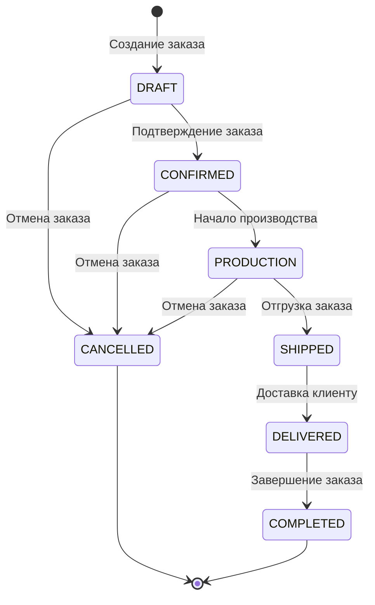
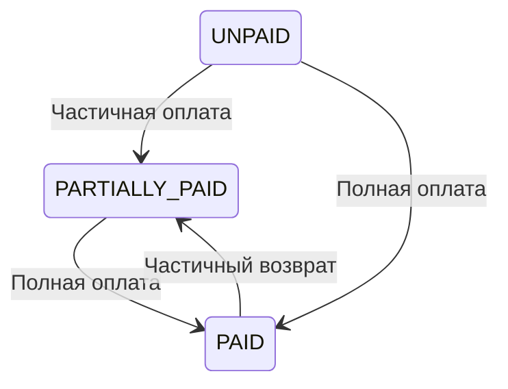

# Order Management System Documentation

## Overview
Система управления заказами ERP-сервера позволяет создавать, отслеживать и управлять производственными заказами на изготовление мебели. Система обеспечивает полный жизненный цикл заказа от создания до завершения.

## Order Lifecycle Workflow

### State Diagram


### Status Transitions Description

#### 1. DRAFT (Черновик)
- **Initial State**: Новый заказ только создан
- **Available Actions**:
  - Добавление секций и позиций
  - Редактирование информации о клиенте
  - Расчет стоимости
  - Подтверждение заказа
  - Отмена заказа

#### 2. CONFIRMED (Подтвержден)
- **Trigger**: Подтверждение заказа менеджером
- **Business Rules**:
  - Заказ не может быть изменен после подтверждения
  - Автоматическое резервирование материалов
  - Создание производственных заданий
- **Available Actions**:
  - Начало производства
  - Отмена заказа (требует подтверждения)

#### 3. PRODUCTION (Производство)
- **Trigger**: Начало производственного процесса
- **Business Rules**:
  - Заказ передан в производство
  - Отслеживание прогресса выполнения
  - Управление сроками изготовления
- **Available Actions**:
  - Обновление статуса производства
  - Отгрузка готовых позиций
  - Отмена заказа (только частичная)

#### 4. SHIPPED (Отгружен)
- **Trigger**: Отгрузка заказа со склада
- **Business Rules**:
  - Все позиции отгружены
  - Создание документов доставки
  - Обновление статуса оплаты
- **Available Actions**:
  - Доставка клиенту

#### 5. DELIVERED (Доставлен)
- **Trigger**: Подтверждение доставки клиентом
- **Business Rules**:
  - Заказ доставлен по адресу
  - Проверка комплектности
  - Подписание актов приемки
- **Available Actions**:
  - Завершение заказа

#### 6. COMPLETED (Завершен)
- **Final State**: Заказ успешно завершен
- **Business Rules**:
  - Все обязательства исполнены
  - Архивирование заказа
  - Генерация отчетов

#### 7. CANCELLED (Отменен)
- **Termination State**: Заказ отменен
- **Business Rules**:
  - Возможна отмена на любом этапе
  - Разрезервирование материалов
  - Возврат предоплаты при наличии
  - Документирование причины отмены

## Business Rules

### Order Creation Requirements
- Уникальный номер заказа (генерируется автоматически)
- Обязательная информация о клиенте
- Сроки выполнения заказа
- Как минимум одна секция с позициями

### Payment Status Integration


### Status Transition Constraints
1. **DRAFT → CONFIRMED**: Только менеджер может подтвердить
2. **CONFIRMED → PRODUCTION**: Только после резервирования материалов
3. **PRODUCTION → SHIPPED**: Только после завершения производства всех позиций
4. **SHIPPED → DELIVERED**: Только после фактической доставки
5. **Any Status → CANCELLED**: Требуется указание причины отмены

## Order Structure

### Main Components
```
Order
├── Order Sections (Секции заказа)
│   ├── Kitchen Facades
│   ├── Kitchen Drawers  
│   └── Wardrobe Doors
└── Order Items (Позиции)
    ├── Facade Panels
    ├── Drawer Fronts
    └── Drawer Boxes
```

### Order Properties
- **orderNumber**: Уникальный номер заказа (например, "ORD-2026-001")
- **clientId/clientName**: Информация о клиенте
- **deadline**: Срок выполнения заказа
- **totalAmount**: Общая стоимость заказа
- **status**: Текущий статус заказа
- **paymentStatus**: Статус оплаты

## API Endpoints

### Order Management
```
GET    /api/orders                    # Получить список заказов
POST   /api/orders                    # Создать новый заказ
GET    /api/orders/{id}              # Получить заказ по ID
PUT    /api/orders/{id}              # Обновить заказ
PATCH  /api/orders/{id}/status        # Изменить статус заказа
DELETE /api/orders/{id}              # Удалить заказ (только черновики)
```

### Order Sections
```
POST   /api/orders/{orderId}/sections           # Добавить секцию
PUT    /api/orders/{orderId}/sections/{sectionId} # Обновить секцию
DELETE /api/orders/{orderId}/sections/{sectionId} # Удалить секцию
```

### Order Items
```
POST   /api/orders/{orderId}/sections/{sectionId}/items     # Добавить позицию
PUT    /api/orders/{orderId}/sections/{sectionId}/items/{itemId} # Обновить позицию
DELETE /api/orders/{orderId}/sections/{sectionId}/items/{itemId} # Удалить позицию
```

## Event System

### Order Events
- `OrderCreatedEvent`: Заказ создан
- `OrderConfirmedEvent`: Заказ подтвержден
- `OrderProductionStartedEvent`: Начало производства
- `OrderShippedEvent`: Заказ отгружен
- `OrderDeliveredEvent`: Заказ доставлен
- `OrderCompletedEvent`: Заказ завершен
- `OrderCancelledEvent`: Заказ отменен

### Event Handlers
Система использует event-driven архитектуру для автоматического обновления связанных систем:
- Обновление статуса оплаты
- Резервирование/освобождение материалов
- Уведомление клиентов
- Генерация отчетов

## Integration Points

### With Pricing Module
- Автоматический расчет стоимости при добавлении позиций
- Применение модификаторов цен
- Обновление общей суммы заказа

### With Inventory Module
- Резервирование материалов при подтверждении
- Отслеживание доступности компонентов
- Автоматическое освобождение при отмене

### With Accounting Module
- Автоматическое обновление статуса оплаты
- Создание финансовых документов
- Отслеживание задолженностей

## Error Handling

### Common Validation Errors
- Недопустимый статус перехода
- Отсутствие обязательных полей
- Конфликт номеров заказов
- Недостаток материалов для производства

### Recovery Procedures
- Rollback статуса при ошибках
- Логирование всех операций
- Уведомление администраторов о критических ошибках

## Monitoring and Metrics

### Key Performance Indicators
- Среднее время обработки заказа
- Процент успешных доставок
- Время от подтверждения до отгрузки
- Количество отмененных заказов

### Alerts
- Превышение сроков выполнения
- Низкий уровень оплаты
- Проблемы с доставкой
- Системные ошибки обработки заказов