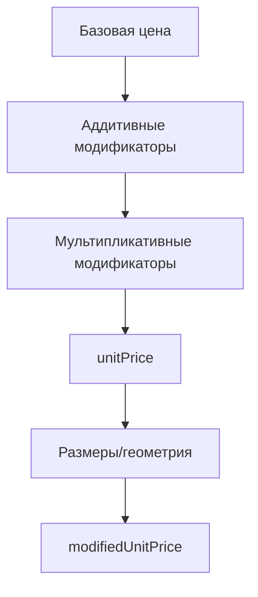

# Порядок применения модификаторов цен и бизнес-правила

## Обзор системы модификаторов

Система модификаторов цен позволяет гибко настраивать цены продукции в зависимости от различных параметров: свойств товара, условий заказа, сезонных факторов и т.д.

## Типы модификаторов

### 1. FIXED_AMOUNT (Фиксированная сумма)
**Описание:** Добавляет или вычитает фиксированную денежную сумму к текущей цене.

**Формула:** `новая_цена = текущая_цена + значение`

**Примеры:**
- `+1000` - добавить 1000 рублей за декоративную филенку
- `-500` - скидка 500 рублей за объемный заказ

**Бизнес-случаи:**
- Дополнительные опции и аксессуары
- Скидки за количество
- Премии за выбор определенных материалов

### 2. PERCENTAGE (Процент)
**Описание:** Применяет процентную надбавку или скидку к базовой цене.

**Формула:** `новая_цена = текущая_цена + (базовая_цена × значение / 100)`

**Примеры:**
- `+15` - надбавка 15% за премиум модель
- `-10` - скидка 10% для постоянных клиентов

**Бизнес-случаи:**
- Сезонные скидки
- Премии за класс продукции
- Дисконтные программы

### 3. MULTIPLIER (Множитель)
**Описание:** Умножает текущую цену на заданный коэффициент.

**Формула:** `новая_цена = текущая_цена × значение`

**Примеры:**
- `×1.3` - увеличение цены в 1.3 раза за эксклюзивный материал
- `×0.9` - скидка 10% (умножение на 0.9)

**Бизнес-случаи:**
- Категории материалов (массив, МДФ, пластик)
- Уровни сложности изготовления
- Брендовые наценки

### 4. FIXED_PRICE (Фиксированная цена)
**Описание:** Заменяет всю расчетную цену на заданное значение, игнорируя предыдущие модификаторы.

**Формула:** `новая_цена = значение`

**Примеры:**
- `5000` - фиксированная цена независимо от параметров

**Бизнес-случаи:**
- Акционные предложения
- Специальные тарифы
- Промо-цены

### 5. PER_UNIT (За единицу)
**Описание:** Задает цену за единицу измерения, игнорируя базовую цену.

**Формула:** `новая_цена = значение × единицы_измерения`

**Примеры:**
- `2000` - 2000 рублей за 1 м²

**Бизнес-случаи:**
- Альтернативные системы ценообразования
- Специфические тарифы для категорий

## Порядок применения

### Этап 1: Сортировка по приоритету
Модификаторы применяются в порядке возрастания значения `priority`:
- `priority: 1` - применяется первым
- `priority: 10` - применяется позже

### Этап 2: Группировка по типу
1. **Аддитивные модификаторы** (FIXED_AMOUNT, PERCENTAGE)
2. **Мультипликативные модификаторы** (MULTIPLIER)

### Этап 3: Последовательное применение



## Условия применения

### Простые условия
```json
{
  "propertyId": 123,
  "propertyValue": "премиум"
}
```
Применяется когда свойство с ID=123 имеет значение "премиум".

### Сложные условия (SQL-подобный синтаксис)
```sql
propertyValue > 3000 AND propertyValue LIKE 'цвет:%'
```

### Поддерживаемые операторы:
- `=` (равенство)
- `!=` (неравенство)
- `<`, `>`, `<=`, `>=` (сравнения)
- `LIKE` (поиск по шаблону)
- `IN` (вхождение в список)
- `BETWEEN` (в диапазоне)
- `AND`, `OR`, `NOT` (логические операторы)

## Бизнес-правила и ограничения

### Валидация модификаторов

#### FIXED_AMOUNT
- Значение может быть отрицательным (скидки)
- Максимальная скидка: 90% от базовой цены
- Минимальное значение: -999999

#### PERCENTAGE
- Диапазон: от -90% до +1000%
- Отрицательные значения = скидки
- Положительные значения = надбавки

#### MULTIPLIER
- Минимальное значение: 0.1 (90% скидка)
- Максимальное значение: 10 (900% надбавка)
- Значение не может быть отрицательным

#### FIXED_PRICE
- Минимальное значение: 0
- Максимальное значение: 9999999
- Значение не может быть отрицательным

### Приоритеты по умолчанию

#### Системные модификаторы (приоритет 1-10):
- Акции и распродажи: priority 1-3
- Брендовые наценки: priority 4-5
- Сезонные скидки: priority 6-8

#### Стандартные модификаторы (приоритет 11-50):
- Модели и серии: priority 11-20
- Материалы: priority 21-30
- Цвета и отделка: priority 31-40
- Дополнительные опции: priority 41-50

#### Пользовательские модификаторы (приоритет 51+):
- Индивидуальные скидки: priority 51-100
- Специальные условия: priority 101+

## Примеры комплексных сценариев

### Сценарий 1: Премиум кухня
```json
[
  {
    "name": "Премиум серия",
    "type": "MULTIPLIER",
    "value": 1.5,
    "priority": 15,
    "condition": "propertyValue = 'премиум'"
  },
  {
    "name": "Массив дуба",
    "type": "MULTIPLIER", 
    "value": 1.3,
    "priority": 25,
    "condition": "propertyValue = 'массив_дуб'"
  },
  {
    "name": "Скидка постоянному клиенту",
    "type": "PERCENTAGE",
    "value": -5,
    "priority": 60,
    "condition": "customerId IN (1001, 1002, 1003)"
  }
]
```

### Сценарий 2: Акционное предложение
```json
[
  {
    "name": "Черная пятница",
    "type": "FIXED_PRICE",
    "value": 3500,
    "priority": 1,
    "condition": "date BETWEEN '2026-11-25' AND '2026-11-30'"
  },
  {
    "name": "Бесплатная доставка",
    "type": "FIXED_AMOUNT",
    "value": -800,
    "priority": 5,
    "condition": "orderTotal > 15000"
  }
]
```

## Конфликты и разрешения

### Приоритет при конфликтах
1. Модификаторы с меньшим `priority` имеют преимущество
2. FIXED_PRICE всегда перекрывает другие типы
3. При равных priority применяется первый по времени создания

### Специальные случаи
- **Круговые зависимости:** система предотвращает бесконечные циклы
- **Противоречивые условия:** применяется модификатор с более высоким приоритетом
- **Неприменимые модификаторы:** игнорируются без ошибок

## Мониторинг и отладка

### Логирование применения
- Запись каждого примененного модификатора
- Время применения
- Результат изменения цены
- Причина применения (условие)

### Метрики эффективности
- Процент примененных модификаторов
- Средняя величина изменения цены
- Частота использования каждого типа
- Время обработки условий

## Тестирование бизнес-правил

### Unit тесты для каждого правила
- Валидация граничных значений
- Проверка условий применения
- Тестирование приоритетов
- Обработка ошибочных данных

### Integration тесты
- Тестирование с реальной базой данных
- Проверка сложных условий
- Валидация производительности
- Тестирование конфликтов

---
*Документ обновлен: Январь 2026*
*Версия: 1.0*