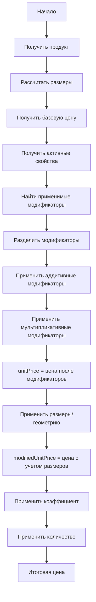

# Алгоритм расчета цен в системе ERP

## Обзор

Система ценообразования ERP реализует сложную логику расчета цен с учетом множества факторов: базовых цен, модификаторов, размеров изделий, коэффициентов и количества.

## Основные компоненты

### 1. Сервисы расчета цен

#### ProductPriceCalculatorService
Основной сервис для расчета цен продукции с учетом всех параметров.

#### PriceCalculationService  
Сервис для расчета цен на основе модификаторов без привязки к конкретному продукту.

## Алгоритм расчета

### Последовательность шагов



### Подробное описание шагов

#### 1. Получение продукта
- Загрузка информации о продукте из базы данных
- Извлечение базовой цены и стандартных размеров

#### 2. Расчет размеров
- Использование пользовательских размеров, если предоставлены
- Иначе использование стандартных размеров продукта
- Для разных типов единиц измерения:
  - **м²**: площадь = длина × ширина
  - **п.м.**: длина = длина изделия
  - **шт.**: единица измерения = 1

#### 3. Получение базовой цены
- `basePrice` = цена продукта из каталога

#### 4. Получение активных свойств
- Сбор стандартных активных свойств продукта
- Добавление свойств, выбранных пользователем
- Приоритет у пользовательских значений

#### 5. Поиск применимых модификаторов
- Запрос всех активных модификаторов из базы
- Фильтрация по условиям применения
- Проверка соответствия свойствам продукта

#### 6. Разделение модификаторов
```typescript
const additiveModifiers = modifiers.filter(
  m => m.type === FIXED_AMOUNT || m.type === PERCENTAGE
);

const multiplicativeModifiers = modifiers.filter(
  m => m.type === MULTIPLIER
);
```

#### 7. Применение аддитивных модификаторов
```typescript
let priceAfterAdditive = basePrice;
for (const modifier of additiveModifiers) {
  if (modifier.type === FIXED_AMOUNT) {
    priceAfterAdditive += modifier.value;
  } else if (modifier.type === PERCENTAGE) {
    priceAfterAdditive += basePrice * (modifier.value / 100);
  }
}
```

#### 8. Применение мультипликативных модификаторов
```typescript
let priceAfterMultiplicative = priceAfterAdditive;
for (const modifier of multiplicativeModifiers) {
  priceAfterMultiplicative *= modifier.value;
}
```

#### 9. Расчет итоговых цен
```typescript
// Цена за единицу измерения после модификаторов
unitPrice = priceAfterMultiplicative;

// Цена с учетом размеров/геометрии
modifiedUnitPrice = unitPrice * unitMeasurement;

// Цена с коэффициентом
priceWithCoefficient = modifiedUnitPrice * coefficient;

// Итоговая цена
finalPrice = priceWithCoefficient * quantity;
```

## Типы модификаторов

### 1. FIXED_AMOUNT (Фиксированная сумма)
- Добавляет/вычитает фиксированную сумму к цене
- Пример: +1000 руб за декоративную филенку

### 2. PERCENTAGE (Процент)
- Добавляет/вычитает процент от базовой цены
- Пример: -15% сезонная скидка

### 3. MULTIPLIER (Множитель)
- Умножает текущую цену на коэффициент
- Пример: ×1.3 за премиальный материал

### 4. FIXED_PRICE (Фиксированная цена)
- Заменяет всю расчетную цену на заданное значение
- Пример: фиксированная цена 5000 руб независимо от параметров

### 5. PER_UNIT (За единицу)
- Задает цену за единицу измерения
- Пример: 2000 руб за 1 м²

## Условия применения модификаторов

### Простые условия
```json
{
  "propertyId": 123,
  "propertyValue": "премиум"
}
```

### Сложные условия (SQL-подобный синтаксис)
```sql
propertyValue > 3000 AND propertyValue LIKE 'цвет:%'
```

## Примеры расчетов

### Пример 1: Стандартный расчет фасада кухни

**Исходные данные:**
- Базовая цена: 1500 руб/м²
- Размеры: 2.0м × 0.8м = 1.6 м²
- Модификаторы:
  - +1000 руб (модель "Вероника")
  - +500 руб (филенка стандарт)
  - ×1.3 (материал массив)
- Коэффициент: 1.2
- Количество: 10 шт

**Расчет:**
```
1. Базовая цена: 1500 руб/м²
2. Аддитивные модификаторы: 
   1500 + 1000 + 500 = 3000 руб/м²
3. Мультипликативные модификаторы:
   3000 × 1.3 = 3900 руб/м² (unitPrice)
4. Размеры:
   3900 × 1.6 = 6240 руб (modifiedUnitPrice)
5. Коэффициент:
   6240 × 1.2 = 7488 руб
6. Количество:
   7488 × 10 = 74880 руб (итоговая цена)
```

### Пример 2: Погонный метр плинтуса

**Исходные данные:**
- Базовая цена: 200 руб/п.м.
- Длина: 4.0 п.м.
- Модификаторы: нет
- Коэффициент: 1.0
- Количество: 5 шт

**Расчет:**
```
1. Базовая цена: 200 руб/п.м.
2. Модификаторы: отсутствуют
3. Цена за единицу: 200 руб/п.м. (unitPrice)
4. Размеры: 200 × 4.0 = 800 руб (modifiedUnitPrice)
5. Коэффициент: 800 × 1.0 = 800 руб
6. Количество: 800 × 5 = 4000 руб (итоговая цена)
```

## Поля результата расчета

### PriceCalculationResult Interface

```typescript
interface PriceCalculationResult {
  basePrice: number;          // Базовая цена номенклатуры
  unitPrice: number;          // Цена за 1 м²/п.м./шт после модификаторов
  modifiedUnitPrice: number;  // Итоговая цена с учетом размеров
  quantity: number;           // Количество единиц
  unitType: 'm2' | 'linear_meter' | 'unit'; // Тип единицы измерения
  dimensions: {               // Фактические размеры
    length: number;
    width: number; 
    depth: number;
  };
  coefficient: number;        // Дополнительный коэффициент
  modifiersApplied: AppliedModifier[]; // Примененные модификаторы
  subtotal: number;           // Промежуточный итог
  finalPrice: number;         // Итоговая стоимость
}
```

## Особенности реализации

### Приоритет модификаторов
- Модификаторы сортируются по полю `priority` (меньше = выше приоритет)
- Применяются в порядке возрастания значения priority

### Обработка ошибок
- Валидация входных параметров
- Проверка на отрицательные значения
- Обработка деления на ноль (коэффициент по умолчанию = 1)

### Производительность
- Кэширование активных модификаторов
- Оптимизация запросов к базе данных
- Минимизация вычислений в циклах

## Тестирование

### Unit тесты
- Проверка каждого шага алгоритма
- Тестирование edge cases (нулевые значения, большие числа)
- Валидация всех типов модификаторов

### Integration тесты
- Тестирование с реальной базой данных
- Проверка применения условий модификаторов
- Валидация работы с различными типами продуктов

### E2E тесты
- Полный workflow расчета цены
- Интеграция с другими модулями системы
- Тестирование API endpoint'ов

## Мониторинг и логирование

### Логируемые события
- Начало и завершение расчета
- Применение каждого модификатора
- Ошибки и исключения
- Время выполнения расчетов

### Метрики производительности
- Среднее время расчета
- Количество расчетов в минуту
- Процент ошибок
- Использование памяти

---
*Документ обновлен: Январь 2026*
*Версия: 1.0*