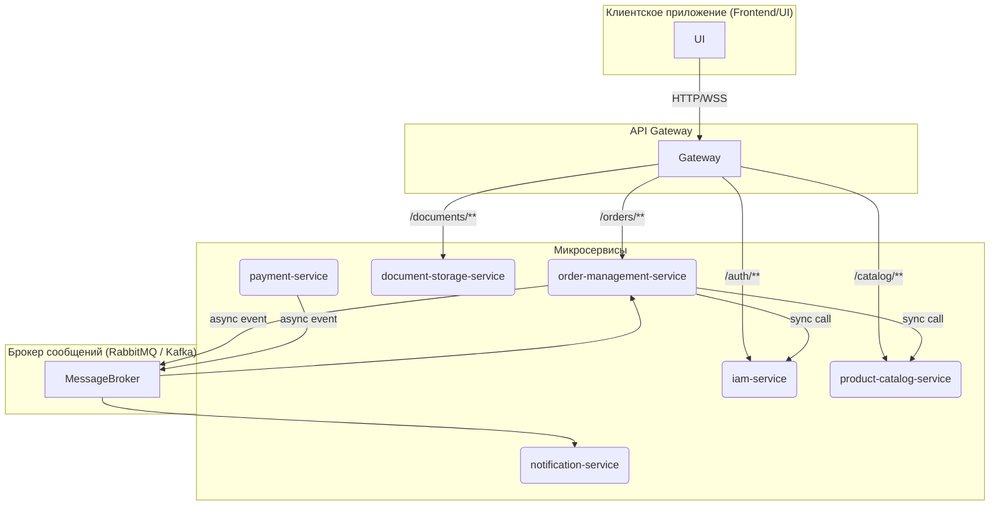
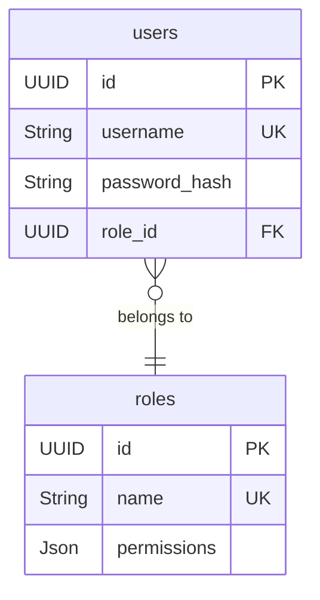
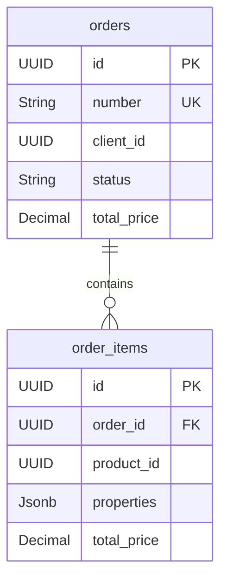

# Архитектурный план ERP-системы

## 1. Введение

Этот документ описывает архитектуру серверной части ERP-системы, спроектированную в соответствии с предоставленными требованиями (`RULES.md`, `СТРАНИЦЫ:.ini`). Цель — создание масштабируемой, поддерживаемой и расширяемой системы на основе микросервисной архитектуры, принципов чистой архитектуры и DDD.

## 2. Архитектурные принципы и правила

Система должна строго следовать правилам, изложенным в `RULES.md`, включая:
- **Технологии**: NestJS (LTS), TypeScript (`"strict": true`), PostgreSQL.
- **Архитектура**: Clean Architecture, Domain-Driven Design (DDD).
- **Структура**: Изолированные модули, представляющие ограниченные контексты.
- **Код**: Строгая типизация (запрет `any`), SOLID, комментарии на русском, покрытие тестами ≥ 80%.

## 3. Детализированные функциональные требования

Этот раздел содержит подробные требования к функциональности системы, извлеченные из документа `СТРАНИЦЫ:.ini`.

### 3.1. Страница заказа
- **Универсальность**: Заказ является универсальным документом для любых производственных операций (фасады, мебель, прием материалов, заказ на склад и т.д.).
- **Печать**: Должна быть возможность печати заявки с настраиваемыми колонками (без цен для производства, только стоимость для клиента, полная для менеджера).
- **Поля заказа**:
    - `Тип заказа`: Выбор из списка.
    - `Дата оформления`: Автоматически при создании.
    - `Дата запуска`: Устанавливается вручную.
    - `Дата выполнения`: Рассчитывается от даты запуска (например, +неделя, +месяц) или вводится вручную.
    - `Клиент`: Выбор из списка.
    - `Наименование`: Ручной ввод. 
    - `Менеджер`: Определяется по пользователю, сохранившему заявку.
- **Шапка заказа**: Дополнительные свойства в шапке должны динамически отображаться в зависимости от типа заказа.
- **Тело заказа**:
    - Состоит из нескольких таблиц с номенклатурными позициями.
    - **Колонки**: Номенклатура, длина, ширина, кол-во, площадь/погонный метр, цена, коэффициент, стоимость, примечание.
    - **Расчеты**: `Площадь = длина * высота * количество`, `Погонный метр = длина * количество`.
- **Строки заказа**:
    - Возможность добавлять/копировать строки.
    - Каждая строка должна разворачиваться для отображения и редактирования дополнительных свойств, включая те, что по умолчанию неактивны (`IsActive: false`).

### 3.2. Управление каталогом (Номенклатура и свойства)
- **Вкладки интерфейса**:
    - **Номенклатуры**: CRUD операции для номенклатур, установка цен, привязка свойств.
    - **Свойства номенклатуры**: CRUD операции для свойств.
    - **Значения свойств**: CRUD для значений, привязанных к свойствам (например, список моделей).
- **Зависимости**: Должна быть страница для управления зависимостями между значениями свойств (например, при выборе "Модель А" автоматически подставляется "Ширина профиля 10 см").

### 3.3. Страница списка заказов
- Отображение ключевых свойств для быстрой идентификации заказа.
- Колонки должны быть настраиваемыми и зависеть от прав доступа пользователя.

### 3.4. Управление пользователями
- Страница со списком пользователей с функциями добавления, изменения и удаления.

<br>

## 4. Микросервисная архитектура

Система разделена на следующие микросервисы, каждый из которых является отдельным Bounded Context:

- **`iam-service`**: Управление пользователями, ролями, аутентификацией и авторизацией.
- **`product-catalog-service`**: Управление номенклатурой, свойствами, ценами и правилами ценообразования.
- **`order-management-service`**: Управление жизненным циклом заказов.
- **`document-storage-service`**: Хранение бинарных файлов (печатные формы, изображения).
- **`notification-service`**: Отправка Email и SMS уведомлений.
- **`payment-service`**: Интеграция с платежными шлюзами.

### 3.1. Схема взаимодействия микросервисов



## 5. Структура проекта

Все сервисы находятся в монорепозитории. Структура каждого сервиса соответствует Clean Architecture, как предписано в `RULES.md`:

```
src/
├── modules/
│   └── <module-name>/
│       ├── domain/
│       ├── application/
│       ├── infrastructure/
│       └── presentation/
├── common/
└── core/
```

## 6. Схемы баз данных (PostgreSQL)

Каждый сервис имеет собственную изолированную БД.

### `iam-service` DB


### `product-catalog-service` DB
```mermaid
erDiagram
    products { UUID id PK; String name; }
    properties { UUID id PK; String name; }
    property_values { UUID id PK; UUID property_id FK; String value; }
    prices { UUID id PK; UUID product_id FK; Decimal amount; }
    price_modifiers { UUID id PK; UUID property_value_id FK; Decimal amount_change; }
    
    products ||--|{ prices : "has"
    properties ||--o{ property_values : "has"
    property_values ||--o{ price_modifiers : "modifies"
```

### `order-management-service` DB


## 7. API и взаимодействие

- **Внешний API**: REST и WebSocket через API Gateway. Все эндпоинты защищены JWT.
- **Внутреннее взаимодействие**:
    - **Синхронное**: Прямые HTTP-вызовы для получения данных (например, `order-service` -> `catalog-service`).
    - **Асинхронное**: Через брокер сообщений для нотификации о событиях (например, `order.created`).

## 8. Стратегия валидации

Многоуровневая валидация:
1.  **Presentation Layer**: Валидация DTO с помощью `class-validator`.
2.  **Application Layer**: Валидация прав доступа и бизнес-логики сценария.
3.  **Domain Layer**: Валидация инвариантов агрегатов и объектов-значений.

## 9. Стратегия тестирования

Используется пирамида тестирования с Jest:
- **Unit-тесты**: Изолированное тестирование доменного и прикладного слоев с полным мокированием зависимостей.
- **Integration-тесты**: Тестирование взаимодействия компонентов внутри одного микросервиса с использованием тестовой БД.
- **E2E-тесты**: Тестирование полных пользовательских сценариев через HTTP-запросы к запущенному приложению.

## 10. Дорожная карта (Roadmap)

Разработка будет вестись итерационно:
1.  **Этап 1 (Фундамент)**: Настройка инфраструктуры, реализация `iam-service` и `product-catalog-service`.
2.  **Этап 2 (Управление заказами)**: Реализация `order-management-service`.
3.  **Этап 3 (Интеграции)**: Реализация `notification-service`, `document-storage-service`, `payment-service`.
4.  **Этап 4 (Продвинутая функциональность)**: WebSocket, аналитика, оптимизация.

```mermaid
gantt
    title Дорожная карта разработки
    dateFormat  YYYY-MM-DD
    section Этап 1
    Фундамент :done, 2026-01-06, 35d
    section Этап 2
    Управление заказами :2026-02-17, 35d
    section Этап 3
    Интеграции :2026-04-07, 42d
    section Этап 4
    Продвинутая функциональность :2026-05-26, 42d