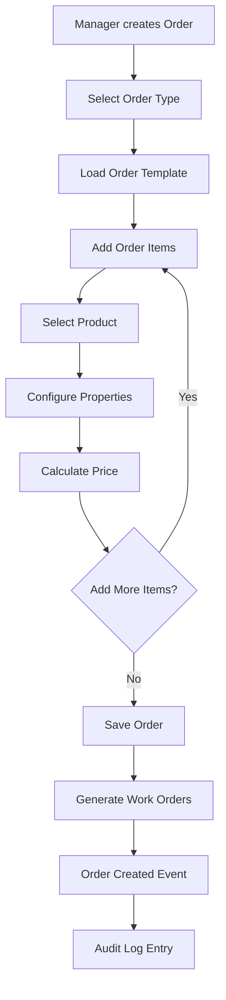
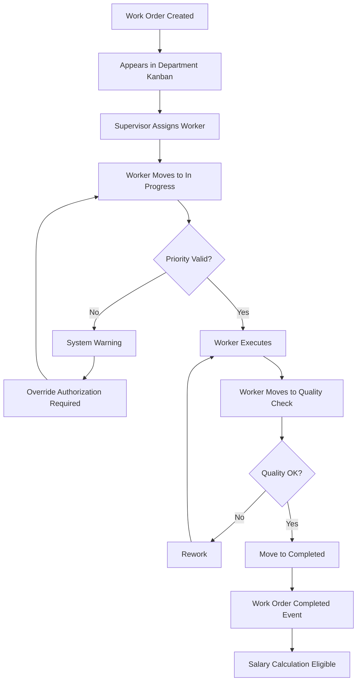
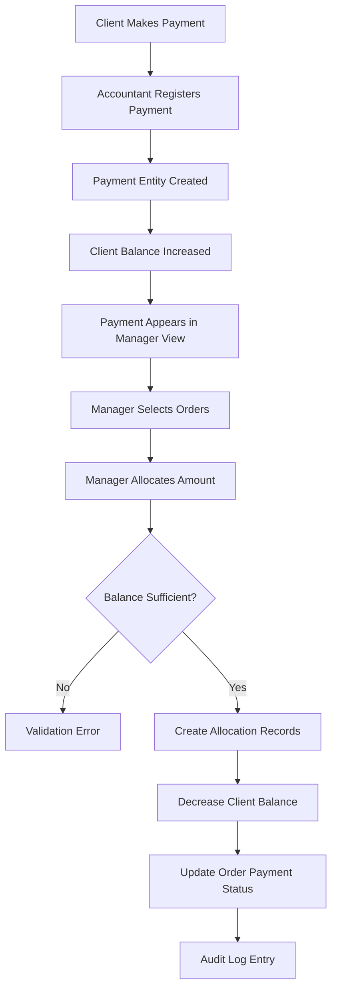
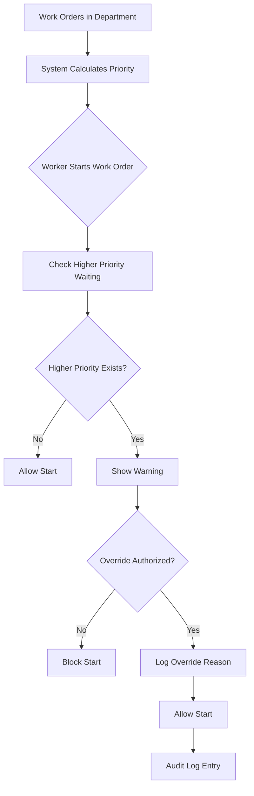
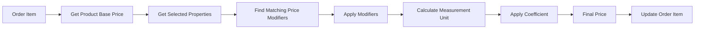
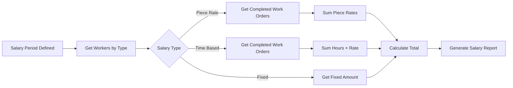
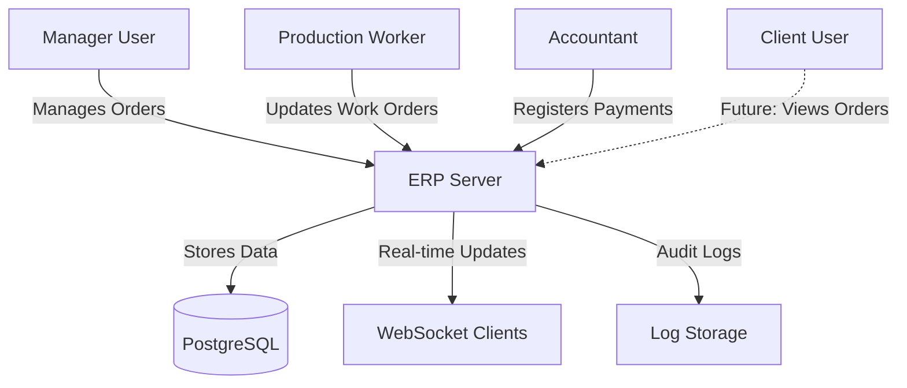
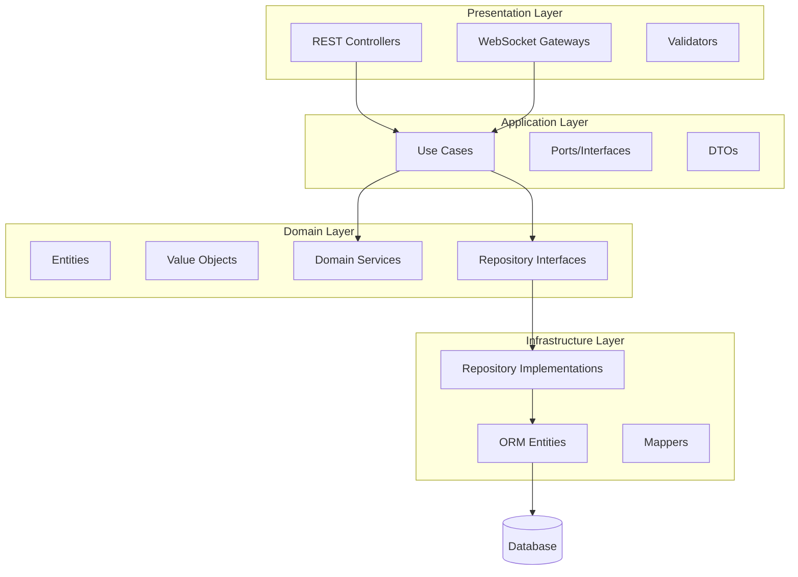

# Сервер ERP-системы управления производством - Проектный документ

## 1. Обзор системы

### 1.1 Назначение

Данный документ описывает проектирование сервера ERP-системы управления производством, построенного на NestJS (LTS), TypeScript (strict mode) и PostgreSQL. Система управляет полным производственным циклом: управление заказами, производственные процессы, выполнение заказ-нарядов, расчет заработной платы и финансовый учет.

### 1.2 Основной бизнес-домен

Система обслуживает производственное предприятие со следующими ключевыми процессами:

- Прием и конфигурирование клиентских заказов с несколькими типовыми шапками
- Планирование производства и управление производственными участками
- Многоэтапное производство с технологическими маршрутами и зависимостями
- Формирование заказ-нарядов с учетом квалификации работников
- Планирование производства на основе приоритетов и сроков
- Назначение работников с учетом квалификации и расчет заработной платы (сдельная, повременная, оклад)
- Учет платежей клиентов и распределение оплат по заказам
- Уведомления в реальном времени через WebSocket

### 1.3 Архитектурные принципы

- **Чистая архитектура (Clean Architecture)** с четким разделением слоев
- **Предметно-ориентированное проектирование (DDD)** с ограниченными контекстами, агрегатами и объектами-значениями
- Соблюдение принципов **SOLID**
- **Изоляция модулей** - отсутствие внутренних зависимостей между модулями
- **Production-ready** код - без заглушек и TODO
- **Комментарии в коде на русском языке**

## 2. Технологический стек

| Слой | Технология |
|-------|------------|
| Runtime | Node.js LTS |
| Фреймворк | NestJS LTS |
| Язык | TypeScript (strict: true) |
| База данных | PostgreSQL |
| ORM | TypeORM / Prisma (без паттерна ActiveRecord) |
| API | REST + WebSocket |
| Тестирование | Jest |
| Валидация | class-validator |

## 3. Ограниченные контексты (Bounded Contexts)

Система организована в следующие ограниченные контексты:

| Контекст | Ответственность | Ключевые агрегаты |
|---------|---------------|----------------|
| Управление заказами | Клиентские заказы, структура заказов, история, расчеты | Order, OrderItem, OrderSection |
| Каталог продукции | Номенклатура, свойства, зависимости | Product, ProductProperty |
| Ценообразование | Базовые цены, модификаторы цен, расчеты | Price, PriceModifier |
| Управление пользователями | Пользователи, роли, типы лиц (клиенты, менеджеры, работники) | User, UserProperty |
| Конфигурация | Шаблоны заказов, шапки заказов, зависимости свойств | OrderTemplate, OrderSectionTemplate, PropertyDependency |
| Производство | Заказ-наряды, выполнение на участках, канбан-доски | WorkOrder, ProductionDepartment, TechnologicalRoute |
| Трудовые ресурсы | Назначение работников, расчет заработной платы, квалификации | WorkerAssignment, SalaryCalculation, WorkerQualification |
| Бухгалтерия | Платежи клиентов, учет баланса, распределение оплат | Payment, ClientBalance |
| Аудит | Логирование активности системы, отслеживание изменений | AuditLog, OrderHistory |

## 4. Основные доменные модели

### 4.1 Агрегат Order (Заказ)

**Order** является центральным производственным документом, который управляет всем производственным процессом.

**Корень агрегата:** Order

**Сущности в составе агрегата:**
- Order (корень)
- OrderSection (шапка заказа/раздел)
- OrderItem (позиция заказа)
- PropertyInOrder (свойство в позиции)
- OrderLog (лог изменений)

**Поля сущности Order:**

| Поле | Тип | Описание |
|-------|------|-------------|
| id | UUID | Уникальный идентификатор |
| numberOrder | string | Сквозной номер заказа |
| typeOrder | string | Тип заказа (из справочника) |
| nameOrder | string | Наименование заказа |
| dateOrder | timestamp | Дата создания (авто) |
| dateStart | timestamp | Дата запуска |
| dateComplete | timestamp | Дедлайн (расчетный или ручной) |
| clientID | UUID | Ссылка на клиента |
| agentID | UUID | Менеджер, который сохранил заказ |
| note | text | Комментарий |
| isLocked | boolean | Заказ заблокирован для редактирования |
| lockedByUserID | UUID | Пользователь, заблокировавший заказ |
| lockedAt | timestamp | Время блокировки |

**Инварианты Order:**
- Заказ должен содержать хотя бы одну OrderSection (шапку)
- OrderSection должна содержать хотя бы один OrderItem
- dateComplete должна быть позже dateStart
- Заказ может изменяться только авторизованными пользователями
- При редактировании заказ блокируется (мягкая блокировка с возможностью принудительного захвата)
- Изменения статуса должны следовать бизнес-правилам

**Доменные события:**
- OrderCreated (заказ создан)
- OrderSectionAdded (добавлена шапка)
- OrderSectionRemoved (удалена шапка)
- OrderItemAdded (добавлена позиция)
- OrderItemRemoved (удалена позиция)
- OrderPropertyChanged (изменено свойство)
- OrderStatusChanged (изменен статус)
- OrderLocked (заказ заблокирован)
- OrderUnlocked (заказ разблокирован)
- OrderCompleted (заказ завершен)

### 4.2 Сущность OrderSection (Шапка заказа)

**OrderSection** представляет собой типовую шапку в заказе с набором общих свойств.

**Поля:**

| Поле | Тип | Описание |
|-------|------|-------------|
| id | UUID | Уникальный идентификатор |
| orderID | UUID | Ссылка на заказ |
| sectionTemplateID | UUID | Ссылка на шаблон шапки |
| sectionName | string | Название шапки (например, "Фасады белые") |
| displayOrder | integer | Порядок отображения |

**Бизнес-правила:**
- В одном заказе может быть несколько шапок
- Шапки могут быть одного типа с разными значениями свойств
- Шапки независимы и могут добавляться/удаляться в любой момент
- При изменении значений свойств в шапке, изменения каскадно применяются ко всем позициям этой шапки

### 4.3 Сущность OrderItem (Позиция заказа)

Представляет одну строку (деталь) в шапке заказа.

**Поля:**

| Поле | Тип | Описание |
|-------|------|-------------|
| id | UUID | Уникальный идентификатор |
| orderSectionID | UUID | Ссылка на шапку заказа |
| productID | UUID | Ссылка на номенклатуру |
| quantity | number | Количество |
| length | number | Длина |
| width | number | Ширина |
| depth | number | Толщина (опционально) |
| calculatedArea | number | Расчетная площадь (длина × ширина × количество) |
| calculatedLinearMeter | number | Расчетные погонные метры (длина × количество) |
| basePrice | decimal | Базовая цена из номенклатуры |
| finalPrice | decimal | Итоговая цена после модификаторов |
| coefficient | decimal | Дополнительный коэффициент |
| note | text | Примечания (в т.ч. информация о конфликтах свойств) |
| hasConflict | boolean | Флаг наличия конфликта значений свойств с шапкой |

**Бизнес-правила:**
- Расчет площади: длина × ширина × количество
- Расчет погонных метров: длина × количество
- Расчет цены: базовая цена + модификаторы × (площадь или погонные метры) × коэффициент
- При включении отключенного свойства цена пересчитывается автоматически
- При конфликте значения свойства с шапкой в note добавляется запись "Название свойства: Значение"

### 4.4 Агрегат Product (Номенклатура)

**Product** представляет номенклатуру с свойствами, ценообразованием и технологическим маршрутом.

**Поля Product:**

| Поле | Тип | Описание |
|------|-----|----------|
| id | UUID | Уникальный идентификатор |
| name | string | Наименование |
| category | string | Категория |
| description | text | Описание |
| unit | enum | Единица измерения (m², п.м., шт.) |
| defaultLength | number | Длина по умолчанию |
| defaultWidth | number | Ширина по умолчанию |
| defaultDepth | number | Толщина по умолчанию |
| basePrice | decimal | Базовая цена за единицу |

**ProductProperty (Свойства номенклатуры):**

Связывает номенклатуру со свойствами и настройками по умолчанию.

| Поле | Тип | Описание |
|------|-----|----------|
| productID | UUID | Ссылка на номенклатуру |
| propertyID | UUID | Ссылка на свойство |
| isActive | boolean | Включено по умолчанию |
| defaultValue | string | Значение по умолчанию |

**Бизнес-правила:**
- Каждая номенклатура имеет набор свойств с флагами isActive
- Отключенные свойства (isActive=false) могут быть включены вручную в заказе
- При включении свойства: автоматически пересчитывается цена и добавляются операции в технологический маршрут
- Свойства с isActive=false используются для гибкого изменения технологического маршрута (например, "приклейка декора")

**Дополнительные параметры для расчетов:**
- Площадь отделки, коэффициент рельефности и другие специальные параметры хранятся как доп.свойства через ProductProperty
- Например: свойство "Коэффициент рельефности" с числовым значением для расчета площади отделки карниза

### 4.5 Система свойств (Properties)

**Property** представляет конфигурируемый атрибут, влияющий на производство и ценообразование.

**Типы свойств:**
- Материал заказа
- Модель фасада
- Филенка
- Материал филенки
- Текстура
- Цвет
- Патина
- Глянцевость
- Присадка (boolean)
- Термошов (boolean)
- Площадь отделки (number)
- Коэффициент рельефности (number)

**PropertyDependency (Зависимости значений свойств):**

Определяет автоматическое разрешение значений свойств.

| Поле | Тип | Описание |
|------|-----|----------|
| id | UUID | Уникальный идентификатор |
| sourcePropertyID | UUID | Триггерное свойство |
| sourceValue | string | Триггерное значение |
| targetPropertyID | UUID | Зависимое свойство |
| targetValue | string | Автоматически устанавливаемое значение |

**Бизнес-правило:**
- Когда Свойство A = Значение X выбрано, автоматически установить Свойство B = Значение Y
- Предотвращает ошибки пользователя и формализует технологические правила

### 4.6 Агрегат Pricing (Ценообразование)

**PriceModifier (Модификатор цены):**

Изменяет базовую цену номенклатуры на основе выбранных свойств.

| Поле | Тип | Описание |
|------|-----|----------|
| id | UUID | Уникальный идентификатор |
| productID | UUID | Ссылка на номенклатуру (опционально - может применяться глобально) |
| propertyID | UUID | Свойство, вызывающее модификатор |
| propertyValue | string | Значение свойства, вызывающее модификатор |
| priceChange | decimal | Изменение цены (положительное или отрицательное) |
| changeType | enum | Абсолютное или процентное изменение |

**Алгоритм расчета цены:**

```
Шаг 1: Начать с basePrice из Product
Шаг 2: Применить все подходящие модификаторы цен из выбранных свойств
Шаг 3: Рассчитать: (basePrice + sum(modifiers)) × единицаИзмерения × coefficient
Шаг 4: Округлить до бизнес-точности
```

### 4.7 Шаблоны заказов и шапок (Configuration)

**OrderTemplate (Шаблон заказа):**

Определяет структуру для разных типов заказов.

| Поле | Тип | Описание |
|------|-----|----------|
| id | UUID | Уникальный идентификатор |
| orderType | string | Тип заказа |
| name | string | Название шаблона |

**OrderSectionTemplate (Шаблон шапки):**

Определяет набор свойств для типовых шапок (фасадная, профильная и т.д.).

| Поле | Тип | Описание |
|------|-----|----------|
| id | UUID | Уникальный идентификатор |
| sectionType | string | Тип шапки (facades, profiles, internal) |
| name | string | Название |

**SectionTemplateProperty (Свойства шаблона шапки):**

| Поле | Тип | Описание |
|------|-----|----------|
| sectionTemplateID | UUID | Ссылка на шаблон шапки |
| propertyID | UUID | Ссылка на свойство |
| isEnabled | boolean | Свойство включено в шаблоне |
| isRequired | boolean | Свойство обязательное |
| displayOrder | integer | Порядок отображения в UI |

**Бизнес-правила:**
- Разные типы заказов (клиентские, внутрипроизводственные) используют разные шаблоны
- Разные типы шапок используют разные наборы свойств
- Изменение шаблона влияет только на новые заказы

**Копирование заказов:**
- Можно копировать заказ целиком в рамках одного типа заказа
- Копируются все шапки, позиции и значения свойств
- Генерируется новый номер заказа

### 4.8 Агрегат User (Пользователь)

**User** — универсальная сущность для клиентов, менеджеров и работников.

| Поле | Тип | Описание |
|------|-----|----------|
| id | UUID | Уникальный идентификатор |
| username | string | Логин |
| passwordHash | string | Хеш пароля |
| fullName | string | Полное имя |
| email | string | Email |
| role | enum | Роль (client, manager, worker, admin) |
| personType | enum | Тип лица (может иметь несколько) |
| isActive | boolean | Активен |

**UserProperty (Дополнительные данные пользователя):**

Хранит дополнительные гибкие данные пользователя.

| Поле | Тип | Описание |
|------|-----|----------|
| userID | UUID | Ссылка на пользователя |
| propertyKey | string | Ключ свойства (например, "phone_2", "inn", "bank_details") |
| propertyValue | text | Значение свойства |

**Роли и права:**
- Admin: полный доступ к системе
- Manager: управление заказами, клиентами, распределение оплат (гибкая настройка видимости)
- Worker: просмотр назначенных заказ-нарядов, обновление статуса
- Client: просмотр собственных заказов (будущая функциональность)

**Настройка прав доступа:**
- Менеджер может видеть все заказы или только заказы закрепленных клиентов (настраивается)
- Права доступа реализуются через RBAC + доменные правила

## 5. Домен управления производством

### 5.1 Технологический маршрут

**TechnologicalRoute (Технологический маршрут):**

Определяет последовательность операций для производства номенклатуры.

| Поле | Тип | Описание |
|------|-----|----------|
| id | UUID | Уникальный идентификатор |
| productID | UUID | Ссылка на номенклатуру |
| propertySetHash | string | Хеш набора свойств (для маршрутов, зависящих от свойств) |
| isDefault | boolean | Маршрут по умолчанию |

**RouteStep (Шаг маршрута):**

| Поле | Тип | Описание |
|------|-----|----------|
| id | UUID | Уникальный идентификатор |
| routeID | UUID | Ссылка на маршрут |
| operationID | UUID | Ссылка на операцию |
| stepOrder | integer | Порядок в маршруте |
| dependsOnStepID | UUID | Зависимость от предыдущего шага (null если нет) |

**Бизнес-правила:**
- Маршрут зависит от свойств номенклатуры (если выбрана покраска, добавляется участок покраски)
- Администратор может переопределить маршрут для конкретного заказа
- Часть операций выполняется параллельно, часть - только после выполнения зависимых этапов
- Если в заказ-наряде есть детали с разными зависимостями, заказ-наряд может стартовать только когда выполнены зависимости для ВСЕХ деталей

**Operation (Операция):**

| Поле | Тип | Описание |
|------|-----|----------|
| id | UUID | Уникальный идентификатор |
| name | string | Название операции |
| description | text | Описание |
| propertyID | UUID | Связь со свойством (если операция добавляется через свойство) |

**OperationRate (Расценки операции):**

| Поле | Тип | Описание |
|------|-----|----------|
| operationID | UUID | Ссылка на операцию |
| rateType | enum | Тип расценки (piece_rate, time_based, per_unit) |
| rateValue | decimal | Величина расценки |
| unitType | enum | За что расценка (за м², за п.м., за штуку, за час) |

**Связь операций со свойствами:**
- Каждое доп.свойство связано с операцией (работой)
- Настраивается для каждого свойства отдельно
- Свойство может означать несколько операций на разных участках
- При включении свойства автоматически добавляются соответствующие операции в маршрут и заказ-наряды

### 5.2 Производственные участки

**ProductionDepartment (Производственный участок):**

| Поле | Тип | Описание |
|------|-----|----------|
| id | UUID | Уникальный идентификатор |
| name | string | Название участка |
| description | text | Описание |
| status | enum | Активен, Недоступен, На обслуживании, Выведен из эксплуатации |
| workOrderGroupingStrategy | enum | Стратегия группировки (by_property, unified) |

**DepartmentOperation (Операции участка):**

| Поле | Тип | Описание |
|------|-----|----------|
| departmentID | UUID | Ссылка на участок |
| operationID | UUID | Ссылка на операцию |
| isPreferred | boolean | Основной участок для этой операции |
| priority | integer | Приоритет участка для операции |

**Примеры участков:**
- Раскрой
- Присадка
- Покраска
- Отделка
- Сборка
- Упаковка

**Бизнес-правила:**
- Список операций, которые может выполнять участок, жестко прописан в настройках участка
- Некоторые операции могут выполняться на нескольких участках (например, фрезеровка фаски)
- Участок имеет статус (Активен, Недоступен, На обслуживании, Выведен из эксплуатации)
- При выходе участка из строя система автоматически предлагает альтернативные участки
- Настройка группировки заказ-нарядов на уровне участка (для участка Покраска - разделять по цветам, для Раскроя - объединять)

### 5.3 Агрегат WorkOrder (Заказ-наряд)

**WorkOrder** — производственный документ, формируемый на основе заказа для конкретного участка.

**Корень агрегата:** WorkOrder

**Поля WorkOrder:**

| Поле | Тип | Описание |
|------|-----|----------|
| id | UUID | Уникальный идентификатор |
| orderID | UUID | Ссылка на заказ |
| departmentID | UUID | Ссылка на производственный участок |
| workOrderNumber | string | Номер заказ-наряда |
| status | enum | Текущий статус |
| priority | integer | Приоритет (рассчитывается из дедлайна заказа) |
| plannedStartDate | timestamp | Плановая дата начала |
| actualStartDate | timestamp | Фактическая дата начала |
| plannedCompletionDate | timestamp | Плановая дата завершения |
| actualCompletionDate | timestamp | Фактическая дата завершения |
| standardHours | decimal | Нормо-часы (автоматически, можно изменить вручную) |
| actualHours | decimal | Фактически затраченные часы |
| pieceRate | decimal | Сдельная расценка (автоматически, можно изменить вручную) |
| calculatedSalary | decimal | Рассчитанная зарплата |
| materialQuantity | decimal | Количество материала (автоматически, можно корректировать) |

**Поток статусов заказ-наряда:**

```
Planned (Запланирован) → Assigned (Назначен) → In Progress (В работе) → Quality Check (На проверке) → Completed (Готов)
```

**Правила перехода статусов:**
- Нельзя перейти в "In Progress" без назначенного работника
- Нельзя перейти в "Completed" без проверки качества (если требуется)
- Нельзя начать менее срочный заказ-наряд, если более срочный ожидает выполнения (с логируемыми исключениями)

**Доменные события:**
- WorkOrderCreated
- WorkOrderAssigned
- WorkOrderStarted
- WorkOrderStatusChanged
- WorkOrderCompleted

**WorkOrderItem (Позиция заказ-наряда):**

| Поле | Тип | Описание |
|------|-----|----------|
| workOrderID | UUID | Ссылка на заказ-наряд |
| orderItemID | UUID | Ссылка на позицию заказа |
| operationID | UUID | Ссылка на операцию |
| quantity | number | Количество |

**Группировка заказ-нарядов:**
- Заказ-наряды группируются по типу номенклатуры и различающимся доп.свойствам
- Настройка группировки на уровне участка:
  - Можно создать один заказ-наряд с указанием разных значений свойств внутри
  - Можно создать отдельные заказ-наряды для разных значений свойств (например, "Покраска фасадов белых" и "Покраска фасадов зеленых")

### 5.4 Планирование производства

**Алгоритм формирования заказ-нарядов:**

```
Шаг 1: При сохранении заказа система анализирует каждую позицию OrderItem
Шаг 2: Для каждой позиции определяется технологический маршрут на основе свойств
Шаг 3: Для каждой операции в маршруте определяется участок (с учетом приоритета)
Шаг 4: Формируются заказ-наряды с группировкой согласно стратегии участка
Шаг 5: Рассчитываются нормо-часы и расценки для каждого заказ-наряда
Шаг 6: Рассчитываются приоритеты на основе дедлайна заказа
```

**Выбор участка для операции:**

```
Шаг 1: Проверить базовый приоритет участка (isPreferred)
Шаг 2: Если есть предпочтительный участок и он активен → выбрать его
Шаг 3: Если нет или недоступен → учесть территориальную близость
Шаг 4: Учесть текущую загрузку участков
Шаг 5: Выбрать оптимальный участок
```

**Квалификация работников:**
- Работники связаны с операциями через таблицу WorkerQualification
- Операция может требовать определенную квалификацию
- При назначении работника система проверяет наличие квалификации
- Назначить можно только квалифицированного работника или с разрешением администратора

### 5.5 Канбан-доски

Каждый производственный участок имеет **Канбан-доску**, визуализирующую статус заказ-нарядов.

**Конфигурация колонок Канбан:**

| Колонка | Статус | Описание |
|---------|--------|----------|
| Запланировано | Planned | Заказ-наряд создан, не назначен |
| Готов | Assigned | Работник назначен, готов к старту |
| В работе | In Progress | Выполняется в данный момент |
| На проверке | Quality Check | Ожидает проверки качества |
| Готово | Completed | Работа завершена |

**Правила Канбан:**
- Заказ-наряды отображаются в порядке приоритета (наиболее срочные первыми)
- Визуальные индикаторы для просроченных заказ-нарядов
- Изменения статуса drag-and-drop (записываются в журнал аудита)
- Руководители участков контролируют переходы на доске

### 5.6 Контроль приоритетов

**Расчет приоритета:**
- Приоритет вычисляется из dateComplete родительского заказа
- Более срочные заказы имеют более высокий номер приоритета
- Система рассчитывает приоритет автоматически

**Принудительное соблюдение приоритетов:**

Система обеспечивает последовательность производства:
- Нельзя начать WorkOrder с более низким приоритетом, если WorkOrder с более высоким приоритетом ожидает на том же участке
- Исключение: авторизованное переопределение (логируется с причиной)
- Визуальные предупреждения на канбан-доске при обнаружении нарушения приоритета

**WorkerQualification (Квалификация работника):**

| Поле | Тип | Описание |
|------|-----|----------|
| id | UUID | Уникальный идентификатор |
| workerID | UUID | Ссылка на работника |
| operationID | UUID | Ссылка на операцию |
| qualificationLevel | enum | Уровень квалификации (trainee, qualified, expert) |
| acquiredDate | timestamp | Дата получения квалификации |

**Альтернативные участки:**
- Система автоматически предлагает альтернативные участки при недоступности основного
- Администратор может вручную пометить участки как альтернативные для операции
- При выборе учитывается территориальная близость и текущая загрузка

## 6. Домен управления трудовыми ресурсами

### 6.1 Система расчета заработной платы

Система поддерживает три типа заработной платы, у каждого работника ровно один активный тип:

**Типы заработной платы:**

| Тип | Метод расчета |
|-----|---------------|
| Сдельная | На основе завершенных заказ-нарядов × сдельная расценка |
| Повременная | На основе нормо-часов × часовая ставка |
| Оклад | Фиксированная месячная сумма (не рассчитывается из заказ-нарядов) |

**Профиль заработной платы работника:**

| Поле | Тип | Описание |
|------|-----|----------|
| workerID | UUID | Ссылка на работника |
| salaryType | enum | Сдельная, повременная или оклад |
| hourlyRate | decimal | Для повременных работников |
| fixedMonthlySalary | decimal | Для работников на окладе |
| isActive | boolean | Активный профиль |

**Бизнес-правила:**
- Только ОДИН активный профиль заработной платы на работника
- Работники на окладе НЕ участвуют в расчетах на основе заказ-нарядов
- Заработная плата рассчитывается ТОЛЬКО из завершенных заказ-нарядов
- Заказ-наряд должен быть в статусе "Completed" для расчета заработной платы

### 6.2 Процесс расчета заработной платы

**Для сдельщиков:**

```
Зарплата = Сумма (WorkOrder.pieceRate) для всех завершенных заказ-нарядов, назначенных работнику за период
```

**Для повременщиков:**

```
Зарплата = Сумма (WorkOrder.actualHours × Worker.hourlyRate) для всех завершенных заказ-нарядов за период
```

**Для работников на окладе:**

```
Зарплата = Worker.fixedMonthlySalary (независимо от заказ-нарядов)
```

**Период заработной платы:**
- Определяется диапазоном дат (обычно месячный)
- Включаются только завершенные заказ-наряды в пределах периода
- Расчет выполняется как пакетный процесс в конце периода

**WorkerAssignment (Назначение работника):**

| Поле | Тип | Описание |
|------|-----|----------|
| id | UUID | Уникальный идентификатор |
| workOrderID | UUID | Ссылка на заказ-наряд |
| workerID | UUID | Ссылка на работника (User) |
| assignmentDate | timestamp | Дата назначения |
| role | enum | Роль в заказ-наряде (primary, assistant) |

**Бизнес-правила:**
- Работник должен быть назначен до того, как заказ-наряд может быть запущен
- Назначение работника неизменяемо после начала работы (создает аудит-след)
- Один заказ-наряд может иметь нескольких работников (команда/бригада)

## 7. Бухгалтерский домен

### 7.1 Управление платежами

**Сущность Payment:**

Представляет входящий платеж от клиента.

| Поле | Тип | Описание |
|------|-----|----------|
| id | UUID | Уникальный идентификатор |
| clientID | UUID | Ссылка на клиента |
| paymentDate | timestamp | Дата платежа |
| amount | decimal | Сумма платежа |
| paymentMethod | enum | Наличные, банковский перевод, карта |
| purpose | string | Назначение/основание платежа |
| registeredByUserID | UUID | Пользователь, зарегистрировавший платеж |

**Доменные события:**
- PaymentReceived (Платеж получен)
- PaymentAllocated (Платеж распределен)

### 7.2 Баланс клиента

**ClientBalance:**

Отслеживает финансовый баланс клиента (агрегированное представление).

| Поле | Тип | Описание |
|------|-----|----------|
| clientID | UUID | Ссылка на клиента |
| currentBalance | decimal | Текущий доступный баланс |
| totalPaid | decimal | Всего получено платежей |
| totalAllocated | decimal | Всего распределено по заказам |

**Операции с балансом:**
- **Кредит (увеличение):** при получении платежа
- **Дебет (уменьшение):** при распределении платежа по заказу

### 7.3 Распределение оплаты по заказам

**OrderPaymentAllocation:**

Связывает платежи с конкретными заказами.

| Поле | Тип | Описание |
|------|-----|----------|
| id | UUID | Уникальный идентификатор |
| orderID | UUID | Ссылка на заказ |
| paymentID | UUID | Ссылка на платеж (опционально - может быть из баланса) |
| allocationAmount | decimal | Распределенная сумма |
| allocationDate | timestamp | Дата распределения |
| allocatedByUserID | UUID | Менеджер, распределивший оплату |

**Бизнес-правила:**
- Менеджер распределяет баланс клиента по заказам
- Нельзя распределить больше, чем доступный баланс клиента
- Отслеживается статус оплаты заказа (неоплачен, частично оплачен, полностью оплачен)
- Каждое распределение создает запись в аудите

### 7.4 Рабочий процесс бухгалтерского модуля

**Поток регистрации платежа:**

```
1. Бухгалтер получает платеж от клиента
2. Бухгалтер регистрирует платеж в системе (создает сущность Payment)
3. Баланс клиента автоматически увеличивается
4. Платеж появляется в представлении менеджера
```

**Поток распределения платежа:**

```
1. Менеджер просматривает заказы клиента и текущий баланс
2. Менеджер распределяет доступный баланс по конкретным заказам
3. Система валидирует распределение (баланс достаточен, заказ существует)
4. Создается запись OrderPaymentAllocation
5. Баланс клиента уменьшается
6. Статус оплаты заказа обновляется
```

## 8. Домен аудита и истории

### 8.1 Журнал аудита

**Сущность AuditLog:**

| Поле | Тип | Описание |
|------|-----|----------|
| id | UUID | Уникальный идентификатор |
| timestamp | timestamp | Время события |
| userID | UUID | Пользователь, инициировавший действие |
| entityType | string | Тип сущности (Order, WorkOrder, Payment и т.д.) |
| entityID | UUID | ID сущности |
| action | enum | Create, Update, Delete, StatusChange |
| description | text | Описание действия |
| oldValue | jsonb | Предыдущее состояние (для обновлений) |
| newValue | jsonb | Новое состояние |

**Логируемые события:**
- Доступ к странице/модулю
- Создание и изменение заказов
- Изменения свойств
- Пересчет цен
- Изменения статуса заказ-нарядов
- Регистрации и распределения платежей
- Авторизации переопределения приоритета

### 8.2 История заказов

**Сущность OrderLog:**

Специализированная история для агрегата Order.

| Поле | Тип | Описание |
|------|-----|----------|
| id | UUID | Уникальный идентификатор |
| orderID | UUID | Ссылка на заказ |
| timestamp | timestamp | Время изменения |
| userID | UUID | Пользователь, внесший изменение |
| changeType | enum | Позиция добавлена, свойство изменено, статус изменен |
| changeDescription | text | Человекочитаемое описание |
| changeData | jsonb | Детализированные данные изменения |

## 9. Проектирование API

### 9.1 Архитектура API

**REST API:**
- Стандартные CRUD операции
- RESTful именование ресурсов
- HTTP глаголы: GET, POST, PUT, PATCH, DELETE
- Коды статуса: 200, 201, 400, 401, 403, 404, 409, 500

**WebSocket:**
- Обновления канбан-доски в реальном времени
- Уведомления о статусе заказ-нарядов
- Обновления прогресса производства

### 9.2 Модули API

| Модуль | Базовый путь | Назначение |
|---------|------------|---------|
| Заказы | /api/orders | Управление заказами |
| Номенклатура | /api/products | Каталог номенклатуры |
| Свойства | /api/properties | Управление свойствами |
| Ценообразование | /api/pricing | Модификаторы цен |
| Пользователи | /api/users | Управление пользователями |
| Заказ-наряды | /api/work-orders | Управление заказ-нарядами |
| Участки | /api/departments | Производственные участки |
| Трудовые ресурсы | /api/workforce | Назначения и зарплата |
| Платежи | /api/payments | Регистрация платежей |
| Бухгалтерия | /api/accounting | Балансы и распределение |
| Аудит | /api/audit | Журналы и история |

### 9.3 Аутентификация и авторизация

**Аутентификация:**
- Аутентификация на основе JWT
- Access token (короткоживущий) + Refresh token (долгоживущий)
- Payload токена включает: userID, role, permissions

**Авторизация:**
- Управление доступом на основе ролей (RBAC)
- Домен-специфичные правила авторизации
- Реализация Guard на уровне контроллеров
- Проверка разрешений на уровне use-case

**Примеры разрешений:**

| Действие | Требуемое разрешение |
|--------|-------------------|
| Создать заказ | order:create |
| Изменить заказ | order:update + проверка владения |
| Просмотр всех заказов | order:view:all |
| Назначить работника | workforce:assign |
| Зарегистрировать платеж | payment:create |
| Распределить платеж | payment:allocate |
| Переопределить приоритет | production:override |

## 10. Валидация данных и инварианты

### 10.1 Уровни валидации

**Слой представления (Контроллеры):**
- Валидация входных DTO с помощью class-validator
- Валидация формата запроса
- Приведение типов

**Слой приложения (Use Cases):**
- Валидация бизнес-правил
- Кросс-сущностная валидация
- Валидация рабочих процессов

**Доменный слой (Сущности/Объекты-значения):**
- Принудительное соблюдение инвариантов
- Валидация состояния сущностей
- Ограничения объектов-значений

### 10.2 Объекты-значения

Объекты-значения инкапсулируют валидацию и бизнес-правила:

**Объект-значение Money:**
- Обеспечивает неотрицательные суммы
- Применяет правила точности
- Неизменяемый

**Объект-значение DateRange:**
- Проверяет начало до окончания
- Проверяет форматы дат
- Расчеты рабочих дней

**Объект-значение Dimensions:**
- Проверяет длину, ширину, толщину
- Обеспечивает положительные значения
- Рассчитывает площадь и погонные метры

## 11. Стратегия обработки ошибок

### 11.1 Категории ошибок

**Доменные ошибки:**
- Нарушения бизнес-правил
- Нарушения инвариантов
- Домен-специфичные исключения
- Пример: OrderCannotBeModifiedException

**Ошибки приложения:**
- Сбои use case
- Нарушения рабочего процесса
- Пример: InsufficientBalanceException

**Инфраструктурные ошибки:**
- Сбои подключения к базе данных
- Сбои внешних сервисов
- Технические исключения

### 11.2 Формат ответа об ошибке

```
{
  "statusCode": 400,
  "error": "ValidationError",
  "message": "Заказ не может быть изменен в текущем статусе",
  "details": {
    "orderId": "uuid",
    "currentStatus": "Completed",
    "reason": "Завершенные заказы неизменяемы"
  },
  "timestamp": "2026-01-05T17:35:00Z",
  "path": "/api/orders/uuid"
}
```

### 11.3 Глобальный фильтр исключений

- Перехватывает все необработанные исключения
- Преобразует доменные/прикладные ошибки в соответствующий HTTP статус
- Очищает сообщения об ошибках для production
- Логирует полные детали ошибки внутренне

## 12. Структура модулей

### 12.1 Структура каталогов проекта

```
src/
├── modules/
│   ├── order/
│   │   ├── domain/
│   │   │   ├── entities/
│   │   │   ├── value-objects/
│   │   │   ├── repositories/
│   │   │   └── services/
│   │   ├── application/
│   │   │   ├── use-cases/
│   │   │   ├── ports/
│   │   │   └── dto/
│   │   ├── infrastructure/
│   │   │   ├── persistence/
│   │   │   ├── repositories/
│   │   │   └── mappers/
│   │   └── presentation/
│   │       ├── controllers/
│   │       └── validators/
│   ├── product/
│   ├── pricing/
│   ├── property/
│   ├── user/
│   ├── configuration/
│   ├── production/
│   ├── workforce/
│   ├── accounting/
│   └── audit/
├── common/
│   ├── config/
│   ├── decorators/
│   ├── guards/
│   ├── interceptors/
│   ├── filters/
│   └── utils/
└── core/
    ├── exception-filters/
    ├── interceptors/
    └── guards/
```

### 12.2 Правила изоляции модулей

- Каждый модуль представляет один ограниченный контекст
- Нет прямых импортов из внутренних папок других модулей
- Межмодульное взаимодействие только через публичные интерфейсы
- Циклические зависимости строго запрещены
- Зависимости направлены внутрь: presentation → application → domain

### 12.3 Управление зависимостями

**Доменный слой:**
- Нет зависимостей от NestJS
- Нет зависимостей от внешних библиотек
- Чистая бизнес-логика
- Независимость от фреймворка

**Слой приложения:**
- Зависит от домена
- Определяет интерфейсы use case (порты)
- Определения DTO
- Оркестрирует доменную логику

**Инфраструктурный слой:**
- Реализует интерфейсы репозиториев домена
- ORM-маппинг сущностей
- Адаптеры внешних сервисов
- Базоданно-специфичная логика

**Слой представления:**
- NestJS контроллеры
- Обработка HTTP запросов/ответов
- WebSocket шлюзы
- Валидация входных данных (class-validator)

## 13. Стратегия тестирования

### 13.1 Типы тестов

**Юнит-тесты:**
- Тестирование отдельных доменных сущностей, объектов-значений, сервисов
- Тестирование use case приложения с моками зависимостей
- Паттерн Arrange-Act-Assert
- 100% покрытие публичных методов

**Интеграционные тесты:**
- Тестирование реализаций репозиториев с тестовой БД
- Тестирование use case с реальной инфраструктурой
- Паттерн Given-When-Then

**Сквозные тесты (E2E):**
- Тестирование полных API-потоков
- Тестирование WebSocket-коммуникации
- Тестирование аутентификации и авторизации
- Реальные HTTP-запросы к тестовому серверу

### 13.2 Организация тестов

```
tests/
├── unit/
│   ├── order/
│   ├── product/
│   └── ...
├── integration/
│   ├── order/
│   └── ...
└── e2e/
    ├── order-management.e2e-spec.ts
    ├── production-workflow.e2e-spec.ts
    └── ...
```

### 13.3 Стратегия мокирования

- Мокирование зависимостей через интерфейсы
- Нет реальной БД в юнит-тестах
- Использование in-memory реализаций для интеграционных тестов
- Тестовые дублеры для внешних сервисов

## 14. Развертывание

### 14.1 Конфигурация окружения

**Переменные окружения:**
- DATABASE_URL
- JWT_SECRET
- JWT_EXPIRATION
- REFRESH_TOKEN_SECRET
- REFRESH_TOKEN_EXPIRATION
- PORT
- NODE_ENV
- LOG_LEVEL

### 14.2 Миграции базы данных

**Стратегия миграций:**
- Файлы миграций под контролем версий
- Автоматическая миграция при развертывании (опционально)
- Возможность отката
- Начальные данные (seed data)

**Инструменты миграции:**
- Миграции TypeORM ИЛИ Prisma
- Скрипты миграции в контроле версий
- Валидация миграций перед развертыванием

### 14.3 Логирование и мониторинг

**Уровни логирования:**
- ERROR: исключения, сбои
- WARN: нарушения бизнес-правил, устаревшие элементы
- INFO: значимые бизнес-события
- DEBUG: детальный поток выполнения

**Метрики мониторинга:**
- Время ответа API
- Производительность запросов к БД
- Коэффициент завершения заказ-нарядов
- Успешность обработки платежей
- Активные WebSocket-соединения

## 15. Производительность

### 15.1 Оптимизация базы данных

**Стратегия индексирования:**
- Индексы на внешних ключах
- Индексы на часто запрашиваемых полях (orderNumber, workOrderNumber)
- Индексы на полях дат, используемых для фильтрации (dateComplete, paymentDate)
- Композитные индексы для распространенных паттернов запросов

**Оптимизация запросов:**
- Пагинация для списковых endpoint
- Eager loading для необходимых связей
- Lazy loading для опциональных связей
- Кеширование результатов запросов для справочных данных

### 15.2 Стратегия кеширования

**Цели кеширования:**
- Каталог номенклатуры (редко меняется)
- Определения свойств (редко меняются)
- Модификаторы цен (редко меняются)
- Разрешения пользователей (инвалидировать при изменении роли)

**Реализация кеширования:**
- In-memory кеш для справочных данных
- Redis для распределенного кеширования (будущее)
- Инвалидация кеша при обновлении сущностей

### 15.3 Масштабируемость

**Горизонтальное масштабирование:**
- Stateless дизайн API
- JWT-токены (нет серверных сессий)
- Пул подключений к БД
- Масштабирование WebSocket с Redis adapter (будущее)

**Вертикальное масштабирование:**
- Оптимизация базы данных
- Эффективные запросы
- Правильное индексирование
- Настройка пула подключений

## 16. Безопасность

### 16.1 Безопасность аутентификации

- Хеширование паролей (bcrypt, минимум 10 раундов)
- Истечение JWT-токенов
- Ротация refresh token
- Рекомендации по безопасному хранению токенов для клиентов

### 16.2 Безопасность авторизации

- Принцип минимальных привилегий
- Управление доступом на основе ролей
- Проверка владения ресурсами
- Аудит-след для всех критичных операций

### 16.3 Безопасность данных

- Валидация и санитаризация ввода
- Защита от SQL-инъекций (параметризованные запросы ORM)
- Защита от XSS (кодирование вывода)
- Конфигурация CORS
- Ограничение частоты запросов на аутентификационных endpoint

### 16.4 Безопасность API

- Только HTTPS в production
- Ограничение размера запросов
- Ограничение частоты на пользователя/IP
- Стратегия версионирования API

## 17. Диаграммы бизнес-процессов

### 17.1 Процесс создания заказа



### 17.2 Процесс выполнения заказ-наряда



### 17.3 Процесс распределения платежа



### 17.4 Поток контроля приоритетов



## 18. Диаграммы потоков данных

### 18.1 Поток расчета цены



### 18.2 Поток расчета зарплаты



## 19. Диаграмма системного контекста



## 20. Диаграмма архитектуры компонентов



## 21. Приоритеты реализации

### Фаза 1: Фундамент (Недели 1-4)
- Настройка проекта с NestJS LTS, TypeScript strict mode
- Проектирование схемы БД и начальные миграции
- Настройка общего модуля (guards, filters, interceptors)
- Модуль аутентификации и авторизации
- Модуль управления пользователями
- Инфраструктура аудит-логирования

### Фаза 2: Управление заказами (Недели 5-8)
- Модуль каталога номенклатуры
- Модуль управления свойствами
- Модуль ценообразования с модификаторами
- Модуль конфигурации (шаблоны заказов)
- Модуль управления заказами
- Управление позициями заказов
- Движок расчета цен

### Фаза 3: Производственный процесс (Недели 9-12)
- Модуль производственных участков
- Модуль заказ-нарядов
- Модуль назначения работников
- REST API канбан-доски
- Логика контроля приоритетов
- Интеграция WebSocket для обновлений в реальном времени

### Фаза 4: Трудовые ресурсы и зарплата (Недели 13-15)
- Управление профилями зарплаты
- Движок расчета зарплаты
- Отслеживание завершения заказ-нарядов
- Отчетность по зарплате

### Фаза 5: Бухгалтерия (Недели 16-18)
- Модуль регистрации платежей
- Отслеживание баланса клиентов
- Модуль распределения платежей
- Отслеживание статуса оплаты заказа

### Фаза 6: Тестирование и доработка (Недели 19-20)
- Полное покрытие юнит-тестами
- Интеграционные тесты для всех модулей
- Сквозные API-тесты
- Тестирование производительности и оптимизация
- Аудит безопасности

## 22. Ограничения и компромиссы проектирования

### 22.1 Выбранные ограничения

- **Только NestJS LTS**: Обеспечивает стабильность и долгосрочную поддержку, ограничивает новейшие функции
- **Strict TypeScript**: Максимальная типобезопасность, увеличивает начальное время разработки
- **Чистая архитектура**: Четкое разделение ответственности, требует больше файлов и абстракций
- **DDD-подход**: Богатые доменные модели, требует более глубокого анализа домена
- **Нет god-сервисов**: Лучшая поддерживаемость, требует тщательной декомпозиции сервисов

### 22.2 Компромиссы

**Чистота домена vs Прагматизм:**
- Доменный слой независим от фреймворка
- Компромисс: Больше абстракций и интерфейсов
- Преимущество: Легче тестировать, возможна миграция на другой фреймворк

**Изоляция модулей vs Повторное использование кода:**
- Строгие границы модулей предотвращают внутренние импорты
- Компромисс: Некоторое дублирование утилитарного кода между модулями
- Преимущество: Полная независимость модулей, легче выделить микросервисы

**Типобезопасность vs Скорость разработки:**
- Принудительный strict режим TypeScript
- Компромисс: Требуется больше явных определений типов
- Преимущество: Меньше ошибок в рантайме, лучшая поддержка IDE

**Событийно-ориентированная архитектура:**
- Доменные события для Order и WorkOrder
- Компромисс: Более сложное отслеживание потока
- Преимущество: Аудит-след, возможность асинхронной обработки

## 23. Точки расширяемости

### 23.1 Планируемые расширения

- **Миграция на микросервисы**: Структура модулей поддерживает выделение в отдельные сервисы
- **Event Sourcing**: Фундамент доменных событий позволяет паттерн event sourcing
- **Расширенная отчетность**: Журналы аудита и история поддерживают сложную бизнес-аналитику
- **Интеграция мобильных приложений**: REST API готов для мобильных клиентов
- **Совместная работа в реальном времени**: Инфраструктура WebSocket поддерживает совместное редактирование
- **Внешние интеграции**: Чистая архитектура позволяет легко добавлять адаптеры

### 23.2 Технологическая эволюция

- **Масштабирование БД**: Паттерн репозитория позволяет read replicas, шардинг
- **Слой кеширования**: Инфраструктурный слой может интегрировать Redis без изменений домена
- **Очередь сообщений**: Доменные события могут публиковаться в RabbitMQ/Kafka
- **Хранилище файлов**: Будущее управление документами через инфраструктурные адаптеры

## 24. Оценка уверенности

**Уровень уверенности: Высокий**

**Основания уверенности:**
- Четкие технические требования (RULES.md со строгими архитектурными рекомендациями)
- Детальная спецификация бизнес-домена (architecture_plan V4.md с полными описаниями процессов)
- Четко определенный технологический стек (NestJS LTS, TypeScript strict, PostgreSQL)
- Установленные архитектурные паттерны (Clean Architecture, DDD, SOLID)
- Проведен полный анализ бизнес-домена
- Все основные рабочие процессы и сущности четко определены
- Нет значительных технических неизвестных или рисков

**Ключевые факторы успеха:**
- Соблюдение строгих архитектурных правил обеспечивает поддерживаемость
- DDD-подход соответствует сложному бизнес-домену
- Четкие ограниченные контексты предотвращают связанность модулей
- Событийно-ориентированный дизайн поддерживает требования к аудиту
- Модульная структура позволяет поэтапную реализацию
